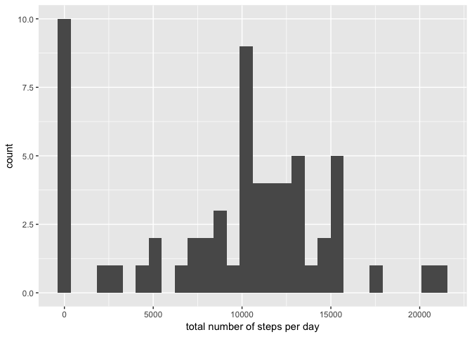
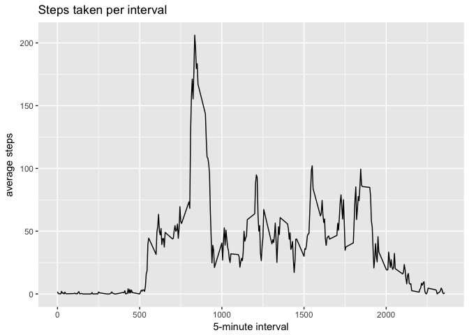
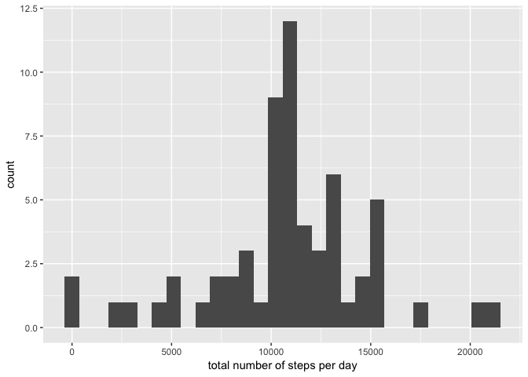
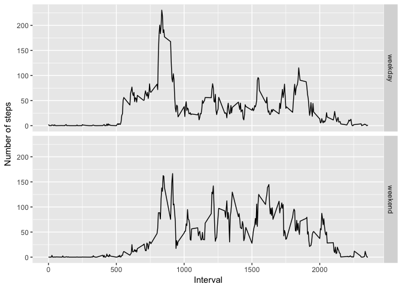

# Reproducible Research: Peer Assessment 1


## Loading and preprocessing the data


```r
activity <- read.csv("activity.csv")
```

## What is mean total number of steps taken per day?

First we caculate the total number of steps per day and draw a histogram.


```r
library(plyr)
steps_per_day <- ddply(activity,.(date),summarize,steps=sum(steps,na.rm=TRUE))
library(ggplot2)
ggplot(data=steps_per_day,aes(steps)) +
    geom_histogram() +
    labs(x="total number of steps per day")
```

```
## `stat_bin()` using `bins = 30`. Pick better value with `binwidth`.
```

<!-- -->

Then we take a look at the mean and median of the total number of steps taken per day:


```r
summary(steps_per_day$steps)
```

```
##    Min. 1st Qu.  Median    Mean 3rd Qu.    Max. 
##       0    6778   10400    9354   12810   21190
```

So the mean total steps per day is 9354 and the median total steps per day is 10400.

## What is the average daily activity pattern?

First, we make a time series plot of the 5-minute interval (x-axis) and the average number of steps taken, averaged across all days (y-axis)


```r
steps_per_interval<-ddply(activity,.(interval),summarize,steps=mean(steps,na.rm=TRUE))
ggplot(data=steps_per_interval,aes(interval,steps))+
    geom_line()+
    labs(title="Steps taken per interval")+
    labs(x="5-minute interval",y="average steps")
```

<!-- -->

Next, let's find out which interval has the maximum number of steps, on average across all the days.


```r
steps_per_interval[which.max(steps_per_interval$steps),]
```

```
##     interval    steps
## 104      835 206.1698
```

So the interval 835 has the maximum steps during the day. 

## Imputing missing values

First, we calculate and report the total number of missing values in the dataset.


```r
table(complete.cases(activity))
```

```
## 
## FALSE  TRUE 
##  2304 15264
```

From the table above, we can see that there are 2304 rows of missing data.

Next, we fill in all of the missing values with the mean value for the 5-minute interval and create a new dataset.

```r
missing<-activity[!complete.cases(activity),]
missing$steps<-round(steps_per_interval$steps[match(missing$interval,steps_per_interval$interval)])
activity_new<-rbind(activity[complete.cases(activity),],missing)
```

Now, the histogram of the total number of steps taken each day would be


```r
steps_per_day_new <- ddply(activity_new,.(date),summarize,steps=sum(steps,na.rm=TRUE))
library(ggplot2)
ggplot(data=steps_per_day_new,aes(steps)) +
    geom_histogram() +
    labs(x="total number of steps per day")
```

```
## `stat_bin()` using `bins = 30`. Pick better value with `binwidth`.
```

<!-- -->

And the mean and median total number of steps taken per day would be

```r
summary(steps_per_day_new$steps)
```

```
##    Min. 1st Qu.  Median    Mean 3rd Qu.    Max. 
##      41    9819   10760   10770   12810   21190
```

We can see that the mean value of the total number of steps taken per day of the new dataset is 10770 and the median vaule is 10760. Inputing the missing data increased the mean and median of the total daily number of steps.

## Are there differences in activity patterns between weekdays and weekends?

First, we create a new factor variable in the dataset with two levels - "weekday" and "weekend" indicating whether a given date is a wekkday or weekend day.


```r
activity_new$day<-as.factor(ifelse(weekdays(as.Date(activity_new$date),abbr=TRUE) %in% c("Sat","Sun"),"weekend","weekday"))
```

Next, let's see the time seriea plot of the 5-minute interval (X-axis) and the average number of steps taken, averaged across all weekday days or weekend days (y-axis). 


```r
steps_per_interval_new<-ddply(activity_new,.(interval,day),summarize,steps=mean(steps,na.rm=TRUE))
ggplot(steps_per_interval_new,aes(interval,steps))+
    geom_line()+
    facet_grid(day~.)+
    labs(x="Interval",y="Number of steps")
```

<!-- -->
